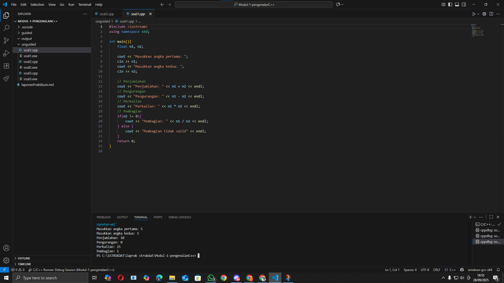
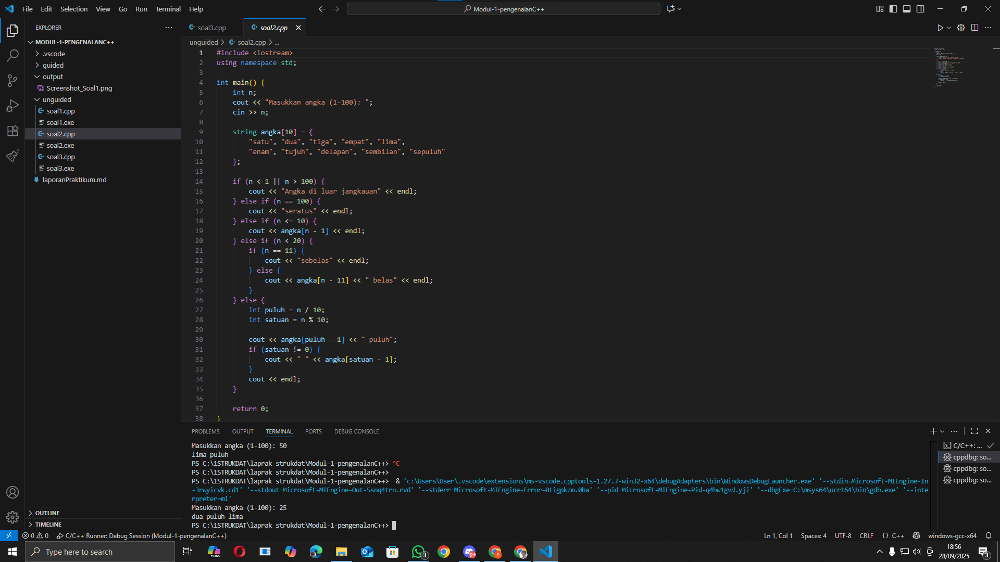
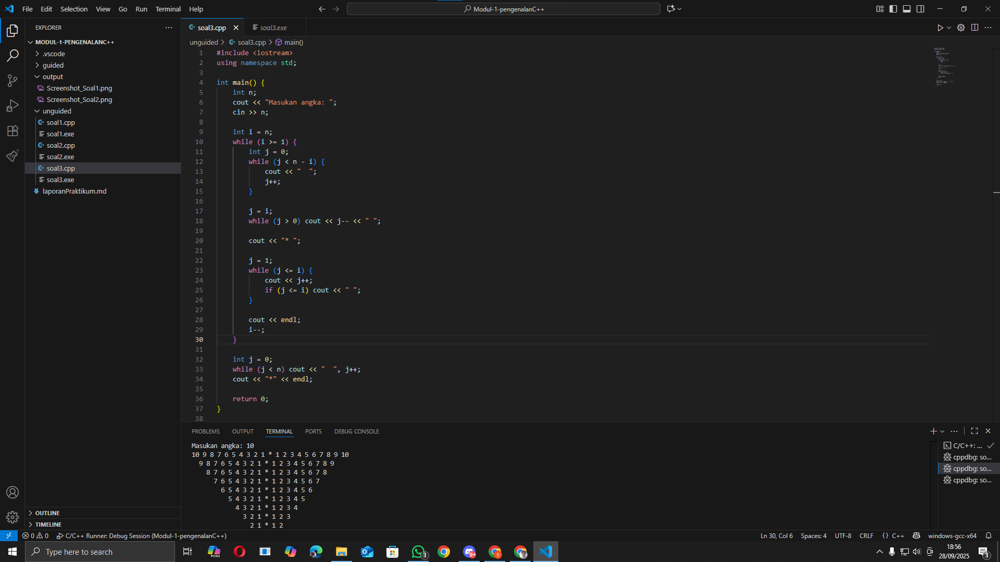

# <h1 align="center">Laporan Praktikum Modul 1 <br> Pengenalan C++</h1>

<p align="center">Fauza Kaizaku Setiawan - 103112400134</p>

## Dasar Teori

Pemrograman adalah proses menyusun instruksi secara logis dan sistematis agar komputer dapat menjalankan suatu tugas. Dalam C++, konsep dasar pemrograman meliputi penggunaan variabel, tipe data, operasi aritmatika, dan struktur kontrol. Variabel digunakan untuk menyimpan data sementara sesuai jenisnya, seperti int untuk bilangan bulat, float/double untuk bilangan desimal, dan string untuk teks, sedangkan operasi aritmatika dasar dapat dilakukan menggunakan operator bawaan C++.

Struktur kontrol seperti if-else, switch-case, serta perulangan for, while, dan do-while menentukan alur jalannya program. Fungsi dan prosedur membantu membagi program menjadi bagian-bagian kecil sehingga kode lebih terstruktur, mudah dipahami, dan dapat digunakan kembali. C++ juga menyediakan struct untuk mengelompokkan beberapa variabel berbeda menjadi satu kesatuan, memudahkan pengelolaan data yang saling terkait, misalnya data mahasiswa yang terdiri dari nama, NIM, dan IPK.

Dengan memahami konsep dasar ini, mahasiswa dapat membuat program sederhana seperti kalkulator aritmatika, pengubah angka menjadi teks, penentu hari kerja atau libur, hingga pencetak pola angka. Latihan-latihan semacam ini melatih kemampuan logika, berpikir komputasional, dan pemahaman terhadap struktur dasar pemrograman, sehingga menjadi fondasi yang kuat untuk mempelajari konsep pemrograman yang lebih kompleks.

## Guided

### Soal 1 Aritmatika

```cpp
#include <iostream>
using namespace std;
int main()
{
    int W, X, Y;
    float Z;
    X = 7;
    Y = 3;
    W = 1;
    Z = (X + Y) / (Y + W);
    cout << "Nilai z = " << Z << endl;
    return 0;
}
```

Program ini menghitung nilai variabel `Z` sebagai hasil dari operasi aritmatika sederhana. Nilai `X`, `Y`, dan `W` diinisialisasi terlebih dahulu, kemudian `Z` dihitung menggunakan rumus `(X + Y) / (Y + W)`. Hasil perhitungan ditampilkan ke layar menggunakan `cout`.


### Soal 2 Fungsi

```cpp
#include <iostream>
using namespace std;

// Prosedur: hanya menampilkan hasil, tidak mengembalikan nilai
void tampilkanHasil(double p, double l)
{
    cout << "\n=== Hasil Perhitungan ===" << endl;
    cout << "Panjang : " << p << endl;
    cout << "Lebar   : " << l << endl;
    cout << "Luas    : " << p * l << endl;
    cout << "Keliling: " << 2 * (p + l) << endl;
}

// Fungsi: mengembalikan nilai luas
double hitungLuas(double p, double l)
{
    return p * l;
}

// Fungsi: mengembalikan nilai keliling
double hitungKeliling(double p, double l)
{
    return 2 * (p + l);
}

int main()
{
    double panjang, lebar;

    cout << "Masukkan panjang: ";
    cin >> panjang;
    cout << "Masukkan lebar  : ";
    cin >> lebar;

    // Panggil fungsi
    double luas = hitungLuas(panjang, lebar);
    double keliling = hitungKeliling(panjang, lebar);

    cout << "\nDihitung dengan fungsi:" << endl;
    cout << "Luas      = " << luas << endl;
    cout << "Keliling  = " << keliling << endl;

    // Panggil prosedur
    tampilkanHasil(panjang, lebar);

    return 0;
}

```

Program ini menghitung luas dan keliling persegi panjang menggunakan fungsi dan prosedur. Pengguna diminta memasukkan panjang dan lebar. Fungsi hitungLuas dan hitungKeliling mengembalikan nilai luas dan keliling, sedangkan prosedur tampilkanHasil langsung menampilkan panjang, lebar, luas, dan keliling ke layar tanpa mengembalikan nilai. Program menunjukkan perbedaan penggunaan fungsi dan prosedur dalam C++.

### Soal 3 Perkondisian

```cpp
#include <iostream>
using namespace std;
// int main()
// {
//     double tot_pembelian, diskon;
//     cout << "total pembelian: Rp";
//     cin >> tot_pembelian;
//     diskon = 0;
//     if (tot_pembelian >= 100000)
//         diskon = 0.05 * tot_pembelian;
//     cout << "besar diskon = Rp" << diskon;
// }

// int main()
// {
//     double tot_pembelian, diskon;
//     cout << "total pembelian: Rp";
//     cin >> tot_pembelian;
//     diskon = 0;
//     if (tot_pembelian >= 100000)
//         diskon = 0.05 * tot_pembelian;
//     else
//         diskon = 0;
//     cout << "besar diskon = Rp" << diskon;
// }

int main()
{
    int kode_hari;
    cout << "Menentukan hari kerja/libur\n"<<endl;
    cout << "1=Senin 3=Rabu 5=Jumat 7=Minggu "<<endl;
    cout << "2=Selasa 4=Kamis 6=Sabtu "<<endl;
    cin >> kode_hari;
    switch (kode_hari)
    {
    case 1:
        cout<<"Hari Kerja";
        break;
    case 2:
        cout<<"Hari Kerja";
        break;
    case 3:
        cout<<"Hari Kerja";
        break;
    case 4:
        cout<<"Hari Kerja";
        break;
    case 5:
        cout<<"Hari Kerja";
        break;
    case 6:
        cout<<"Hari Libur";
        break;
    case 7:
        cout<<"Hari Libur";
        break;
    default:
        cout<<"Kode masukan salah!!!";
    }
    return 0;
}

```

Program ini digunakan untuk **menentukan apakah suatu hari termasuk hari kerja atau hari libur** berdasarkan kode hari yang dimasukkan pengguna. Pengguna memasukkan angka `1–7` yang mewakili hari Senin sampai Minggu. Program kemudian menggunakan **struktur `switch-case`** untuk menampilkan apakah hari tersebut termasuk **hari kerja** (Senin–Jumat) atau **hari libur** (Sabtu–Minggu). Jika kode yang dimasukkan tidak valid, program menampilkan pesan kesalahan.

### Soal 4 Perulangan

```cpp
#include <iostream>
using namespace std;
// int main()
// {
//     int jum;
//     cout << "jumlah perulangan: ";
//     cin >> jum;
//     for (int i = 0; i < jum; i++)
//     {
//         cout << "saya sahroni\n";
//     }
//     return 1;
// }

// while
int main()
{
    int i = 1;
    int jum;
    cin >> jum;
    do
    {
        cout << "bahlil ke-" << (i + 1) << endl;
        i++;
    } while (i < jum);
    return 0;
}
```

Program ini digunakan untuk menampilkan teks berulang sejumlah kali yang ditentukan oleh pengguna. Pengguna memasukkan jumlah perulangan (jum), lalu program menggunakan loop do-while untuk mencetak teks "bahlil ke-" diikuti nomor urut setiap iterasi. Program akan terus mencetak hingga jumlah perulangan tercapai. Versi ini menunjukkan penggunaan perulangan do-while, berbeda dari contoh sebelumnya yang menggunakan for.

### Soal 5 Struct

```cpp
#include <iostream>
#include <string>
using namespace std;

// Definisi struct
struct Mahasiswa {
    string nama;
    string nim;
    float ipk;
};

int main() {

    Mahasiswa mhs1;

    cout << "Masukkan Nama Mahasiswa: ";
    getline(cin, mhs1.nama);
    // cin >> mhs1.nama;
    cout << "Masukkan NIM Mahasiswa : ";
    cin >> mhs1.nim;
    cout << "Masukkan IPK Mahasiswa : ";
    cin >> mhs1.ipk;

    cout << "\n=== Data Mahasiswa ===" << endl;
    cout << "Nama : " << mhs1.nama << endl;
    cout << "NIM  : " << mhs1.nim << endl;
    cout << "IPK  : " << mhs1.ipk << endl;

    return 0;
}

```

Program ini digunakan untuk merekam dan menampilkan data mahasiswa menggunakan struct di C++. Pengguna diminta memasukkan nama, NIM, dan IPK mahasiswa. Data tersebut disimpan dalam sebuah variabel bertipe Mahasiswa yang terdiri dari tiga anggota (nama, nim, ipk). Setelah input, program menampilkan semua informasi mahasiswa ke layar, sehingga memperlihatkan cara penggunaan struct untuk mengelompokkan beberapa data terkait menjadi satu kesatuan.

### Soal 6 Test

```cpp
#include <iostream>
using namespace std;
int main()
{
    string ch;
    cout << "Masukkan sebuah karakter: ";
    // cin >> ch;
    ch = getchar();  //Menggunakan getchar() untuk membaca satu karakter
    cout << "Karakter yang Anda masukkan adalah: " << ch << endl;
    return 0;
}

```

Program ini berfungsi untuk membaca dan menampilkan satu karakter yang dimasukkan pengguna. Pengguna diminta memasukkan sebuah karakter, kemudian program menyimpannya menggunakan **getchar()**. Setelah itu, karakter yang dimasukkan ditampilkan ke layar menggunakan cout. Program ini menunjukkan cara mengambil input karakter tunggal dalam C++.

## Unguided

### Soal 1

Buatlah program yang menerima input-an dua buah bilangan bertipe float, kemudian memberikan output-an hasil penjumlahan, pengurangan, perkalian, dan pembagian dari dua bilangan tersebut.

```cpp
#include <iostream>
using namespace std;

int main(){
    float n1, n2;

    cout << "Masukkan angka pertama: ";
    cin >> n1;
    cout << "Masukkan angka kedua: ";
    cin >> n2;

    // Penjumlahan
    cout << "Penjumlahan: " << n1 + n2 << endl;
    // Pengurangan
    cout << "Pengurangan: " << n1 - n2 << endl;
    // Perkalian
    cout << "Perkalian: " << n1 * n2 << endl;
    // Pembagian
    if(n2 != 0){
        cout << "Pembagian: " << n1 / n2 << endl;
    } else {
        cout << "Pembagian tidak valid" << endl;
    }
    return 0;
}

```

> Output
> 

Program di atas adalah program perhitungan aritmatika yang meminta pengguna memasukkan dua angka bertipe float, lalu melakukan operasi aritmatika dasar: penjumlahan, pengurangan, perkalian, dan pembagian. Program juga memeriksa agar pembagian tidak dilakukan dengan nol, dan menampilkan hasil setiap operasi ke layar.

### Soal 2

Buatlah sebuah program yang menerima masukan angka dan mengeluarkan angak tersebut dalam bentuk tulisan. Angka yang diinput user adalah positif mulai dari 0 s.d 100

```cpp
#include <iostream>
using namespace std;

int main() {
    int n;
    cout << "Masukkan angka (1-100): ";
    cin >> n;

    string angka[10] = {
        "satu", "dua", "tiga", "empat", "lima",
        "enam", "tujuh", "delapan", "sembilan", "sepuluh"
    };

    if (n < 1 || n > 100) {
        cout << "Angka di luar jangkauan" << endl;
    } else if (n == 100) {
        cout << "seratus" << endl;
    } else if (n <= 10) {
        cout << angka[n - 1] << endl;
    } else if (n < 20) {
        if (n == 11) {
            cout << "sebelas" << endl;
        } else {
            cout << angka[n - 11] << " belas" << endl;
        }
    } else {
        int puluh = n / 10;
        int satuan = n % 10;

        cout << angka[puluh - 1] << " puluh";
        if (satuan != 0) {
            cout << " " << angka[satuan - 1];
        }
        cout << endl;
    }

    return 0;
}

```

> Output
> 

Program ini berfungsi untuk mengubah angka menjadi tulisan dalam bahasa Indonesia untuk rentang 1 sampai 100. Pengguna memasukkan sebuah angka, lalu program memeriksa apakah angka tersebut valid. Jika valid, program menampilkan hasil dalam bentuk kata: angka 1–10 langsung ditampilkan, angka 11–19 menggunakan format “[angka] belas” atau “sebelas” untuk 11, angka 20–99 ditampilkan dalam format “[puluhan] puluh [satuan]”, dan angka 100 ditampilkan sebagai “seratus”. Program ini menggunakan array untuk menyimpan kata angka dasar dan struktur if-else untuk menentukan format keluaran sesuai nilai angka.

### Soal 3

Buatlah program yang dapat memberikan input dan output seperti segitiga dengan angka

```cpp
#include <iostream>
using namespace std;

int main() {
    int n;
    cout << "Masukan angka: ";
    cin >> n;

    int i = n;
    while (i >= 1) {
        int j = 0;
        while (j < n - i) {
            cout << "  ";
            j++;
        }

        j = i;
        while (j > 0) cout << j-- << " ";

        cout << "* ";

        j = 1;
        while (j <= i) {
            cout << j++;
            if (j <= i) cout << " ";
        }

        cout << endl;
        i--;
    }

    int j = 0;
    while (j < n) cout << "  ", j++;
    cout << "*" << endl;

    return 0;
}

```

> Output
> 

Program ini berfungsi untuk mencetak pola segitiga terbalik yang simetris menggunakan angka dan simbol bintang. Pengguna memasukkan sebuah angka `n`, lalu program mencetak setiap baris dengan: spasi di awal untuk membentuk segitiga, angka menurun dari nilai baris sampai 1, simbol `*`, dan angka menaik dari 1 sampai nilai baris. Setelah semua baris selesai, program menambahkan baris terakhir berisi simbol `*` di tengah, sehingga terbentuk pola yang rapi dan simetris.


## Referensi

1. Putra, C. K. K., & Hermawan, H. D. (2023). Pengembangan Media Pembelajaran Mobile Pemrograman C++ pada Siswa Kelas X SMK Binawiyata Sragen. Jurnal Pendidikan Teknik Informatika, 2(1), 18–27. https://eprints.ums.ac.id/115405/10/Naskah%20Publikasi_Canygia%20Kalindra%20Putra.pdf

2. Fitriyah, Q. F., Saputri, L. R., & Aljawad, H. I. (2023). Praktik Unplugged Coding Berbasis Kehidupan Sehari-hari dalam Meningkatkan Kemampuan Computational Thinking pada Anak Usia Dini. Jurnal Pendidikan Anak, 12(2), 178–185. https://journal.uny.ac.id/index.php/jpa/article/download/57349/20585/190619

3. Hendrawan, A. (2015). Standard Template Library C++ untuk Mengajarkan Struktur Data. Jurnal Ilmu Komputer, 12(1), 23–30. Universitas Esa Unggul. https://ejurnal.esaunggul.ac.id/index.php/JIK/article/view/397