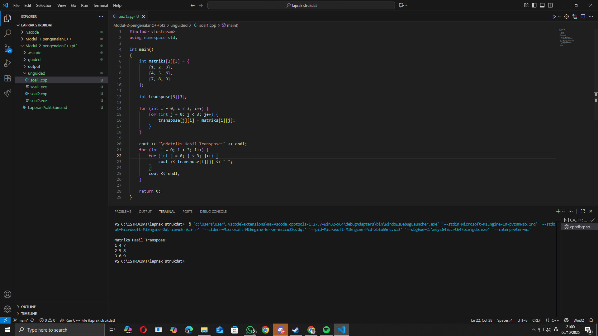

<h1 align="center">Laporan Praktikum Modul 2 <br> Pengenalan C++ (Part 2)</h1>
<p align="center">Fauza Kaizaku Setiawan - 103112400134</p>

Dasar Teori

Pada modul ini dipelajari konsep dasar yang lebih mendalam mengenai array, pointer, dan function dalam bahasa C++.
Array merupakan struktur data yang digunakan untuk menyimpan sekumpulan elemen bertipe sama dalam satu variabel. Setiap elemen dapat diakses menggunakan indeks.
Pointer adalah variabel yang menyimpan alamat memori dari variabel lain. Dengan pointer, program dapat mengakses dan memodifikasi data secara langsung melalui alamat tersebut.
Fungsi (function) digunakan untuk memecah program menjadi bagian-bagian kecil yang dapat digunakan kembali, sedangkan konsep call by pointer dan call by reference berkaitan dengan cara pengiriman parameter ke fungsi.

Call by pointer mengirimkan alamat variabel, sedangkan call by reference mengirimkan referensi langsung ke variabel aslinya. Pemahaman konsep ini penting untuk pengelolaan memori dan efisiensi program.

Guided

Soal 1 Array Satu Dimensi

```cpp
#include <iostream>
using namespace std;

int main() {
    int nilai[5] = {1,2,3,4,5};
    
    for (int i = 0; i < 5; ++i) {
        cout << "Element ke-" << i << " = " << nilai[i] << endl;
    }

    return 0;
}
```

Program ini menampilkan seluruh elemen array satu dimensi berisi lima bilangan. Setiap elemen diakses melalui indeks dari 0 hingga 4 dan dicetak ke layar menggunakan perulangan for.

Soal 2 Array Dua Dimensi
```cpp
#include <iostream>
using namespace std;

int main() {
    int matrix[3][3] = {
        {1,2,3},
        {4,5,6},
        {7,8,9}
    };
    
    for (int i = 0; i < 3; ++i){
        for (int j = 0; j < 3; ++j){
            cout << matrix[i][j] << " ";
        }
        cout << endl;
    }
    return 0;
}
```

Program ini mencetak isi dari array dua dimensi (matriks) berukuran 3x3. Elemen matriks dicetak per baris sehingga membentuk tampilan tabel angka.

Soal 3 Pointer dan Array
```cpp
#include <iostream>
using namespace std;

int main(){
    int data[5] = {10,20,30,40,50};
    int *p_data = data;

    cout << "Mengakses elemen array cara normal:" << endl;
    for (int i = 0; i < 5; ++i){
        cout << "Nilai elemen ke-" << i << ": " << data[i] << endl;
    }

    cout << "Mengakses elemen array menggunakan pointer:" << endl;
    for (int i = 0; i < 5; ++i){
        cout << "Nilai elemen ke-" << i << ": " << *(p_data + i) << endl;
    }

    return 0;
}
```

Program di atas memperlihatkan dua cara mengakses elemen array: secara langsung dengan indeks dan melalui pointer. Pointer p_data menyimpan alamat elemen pertama array dan pergeseran alamat dilakukan dengan p_data + i.

Soal 4 String Pointer
```cpp
#include <iostream>
using namespace std;

int main() {
    char pesan_array[] = "Nasi Padang";
    char *pesan_pointer = "Ayam Bakar 23";

    cout << "String Array: " << pesan_array << endl;
    cout << "String Pointer: " << pesan_pointer << endl;

    pesan_array[0] = 'h';
    cout << "String Array setelah diubah: " << pesan_array << endl;

    pesan_pointer = "Sariman";
    cout << "String Pointer setelah menunjuk ke string lain: " << pesan_pointer << endl;

    return 0;
}
```

Program ini menunjukkan perbedaan antara string yang disimpan dalam array dan string yang diakses melalui pointer. Isi string dalam array dapat diubah per karakter, sedangkan pointer dapat diarahkan ke string lain.

Soal 5 Fungsi
```cpp
#include <iostream>
using namespace std;

int tambah(int a, int b){
    return a + b;
}

void tampilkanHasil(int a, int b, int hasil) {
    cout << "Hasil penjumlahan " << a << " + " << b << " adalah: " << hasil << endl;
}

int main() {
    int angka1 = 10;
    int angka2 = 5;

    int hasilJumlah = tambah(angka1, angka2);
    tampilkanHasil(angka1, angka2, hasilJumlah);

    return 0;
}
```

Program menggunakan fungsi untuk memisahkan proses penjumlahan dan penampilan hasil. Fungsi tambah mengembalikan hasil, sedangkan tampilkanHasil hanya mencetak keluaran tanpa mengembalikan nilai.

Soal 6 Call by Pointer
```cpp
#include <iostream>
using namespace std;

void tukar(int *px, int *py){
    int temp = *px;
    *px = *py;
    *py = temp;
}

int main(){
    int a = 10, b = 20;
    cout << "Sebelum ditukar: a = " << a << ", b = " << b << endl;
    tukar(&a, &b);
    cout << "Setelah ditukar: a = " << a << ", b = " << b << endl;
    return 0;
}
```

Program menukar nilai dua variabel menggunakan pointer. Alamat variabel dikirim ke fungsi, sehingga perubahan di dalam fungsi memengaruhi variabel asli.

Soal 7 Call by Reference
```cpp
#include <iostream>
using namespace std;

void tukar(int &x, int &y){
    int temp = x;
    x = y;
    y = temp;
}

int main(){
    int a = 10, b = 20;
    cout << "Sebelum ditukar: a = " << a << ", b = " << b << endl;
    tukar(a, b);
    cout << "Setelah ditukar: a = " << a << ", b = " << b << endl;
    return 0;
}
```

Pada contoh ini, parameter dikirim dengan reference (&), sehingga fungsi dapat mengubah nilai variabel asli tanpa perlu menggunakan operator dereferensi.

Unguided

Soal 1 Transpose Matriks
```cpp
#include <iostream>
using namespace std;

int main()
{
    int matriks[3][3] = {
        {1, 2, 3},
        {4, 5, 6},
        {7, 8, 9}
    };
    
    int transpose[3][3];

    for (int i = 0; i < 3; i++) {
        for (int j = 0; j < 3; j++) {
            transpose[j][i] = matriks[i][j];
        }
    }

    cout << "\nMatriks Hasil Transpose:" << endl;
    for (int i = 0; i < 3; i++) {
        for (int j = 0; j < 3; j++) {
            cout << transpose[i][j] << " ";
        }
        cout << endl;
    }

    return 0;
}
```
> Output  
> 


Program ini menukar posisi baris menjadi kolom untuk menghasilkan matriks transpose. Loop bersarang digunakan untuk memindahkan nilai antar posisi sesuai indeks.

Soal 2 Fungsi Kuadrat
```cpp
#include <iostream>
using namespace std;

void kuadratkan(int &angka){
    angka = angka * angka;
}

int main(){
    int nilai;
    cout << "Masukkan Nilai = ";
    cin >> nilai;
    cout << "Nilai awal: " << nilai << endl;
    kuadratkan(nilai);
    cout << "Nilai setelah dikuadratkan: " << nilai << endl;
    return 0;
}
```

> Output  
> 


Program menerima input berupa angka, kemudian mengubah nilainya menjadi hasil kuadrat menggunakan fungsi yang memanfaatkan parameter reference. Nilai asli variabel langsung berubah setelah fungsi dijalankan.

Referensi

1. Nugroho, S. (2022). Pemrograman C++ untuk Pemula. Elex Media Komputindo.
2. Hendrawan, A. (2015). Standard Template Library C++ untuk Mengajarkan Struktur Data. Jurnal Ilmu Komputer, 12(1), 23–30. Universitas Esa Unggul.
3. Fitriyah, Q. F., Saputri, L. R., & Aljawad, H. I. (2023). Praktik Unplugged Coding Berbasis Kehidupan Sehari-hari dalam Meningkatkan Kemampuan Computational Thinking pada Anak Usia Dini. Jurnal Pendidikan Anak, 12(2), 178–185.