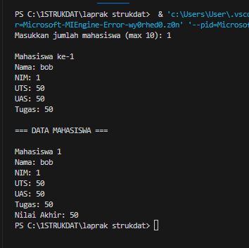
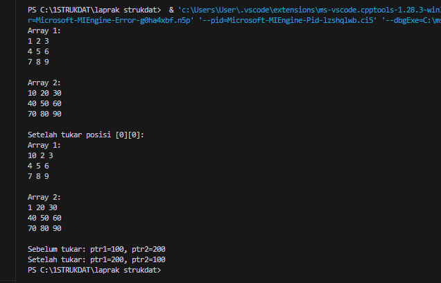

# <h1 align="center">Laporan Praktikum Modul 1 <br> Pengenalan C++</h1>

<p align="center">Fauza Kaizaku Setiawan - 103112400134</p>

## Dasar Teori

Abstrak Data Type (ADT) adalah model matematika yang mendefinisikan suatu tipe data berdasarkan perilaku dari sudut pandang pengguna, bukan berdasarkan implementasi internalnya. Singkatnya, ADT adalah spesifikasi dari sekumpulan data dan sekumpulan operasi yang dapat dilakukan pada data tersebut.

## Guided

### Soal 1 array

### mahasiswa.h
```cpp
#ifndef MAHASISWA_H_INCLUDE
#define MAHASISWA_H_INCLUDE
struct mahasiswa
{
    char nim[10];
    int nilai1, nilai2;

};
void inputMhs(mahasiswa &m);
float rata2(mahasiswa m);
#endif
```

### mahasiswa.cpp
```cpp
#include "mahasiswa.h"
#include <iostream>
using namespace std;

void inputMhs(mahasiswa &m){
    cout << "input nama = ";
    cin >> (m).nim;
    cout << "input nilai1 = ";
    cin >> (m).nilai1;
    cout << "input niali2 = ";
    cin >> (m).nilai2; 
}
float rata2(mahasiswa m) {
    return float(m.nilai1 + m.nilai2) / 2;
    
}
```

### main.cpp
```cpp
#include "mahasiswa.h"
#include <iostream>
using namespace std;

int main(){
    mahasiswa mhs;
    inputMhs(mhs);
    cout << "rata - rata = " << rata2(mhs);
    return 0;
}

```
Program ini melakukan perhitungan rata rata nilai pada mahasiswa. Untuk program mahasiswa.h itu untuk mendeklarasikan tipe data setiap variabel. Lalu mahasiswa.cpp untuk meng input nama mahasiswa, nilai 1, nilai 2, dan meng kalkulasikan nilai 1 ditambah nilai 2 lalu di bagi 2. main.cpp itu untuk mengeluarkan output rata rata dari inputan tadi.


## Unguided

### Soal 1

Buat program yang dapat menyimpan data mahasiswa (max. 10) ke dalam sebuah array dengan field nama, nim, uts, uas, tugas, dan nilai akhir. Nilai akhir diperoleh dari FUNGSI dengan rumus 0.3uts+0.4uas+0.3*tugas.

```cpp
#include <iostream>
using namespace std;

struct Mahasiswa {
    string nama;
    string nim;
    float uts, uas, tugas, nilaiAkhir;
};

int main() {
    Mahasiswa mhs[10];
    int n;
    
    cout << "Masukkan jumlah mahasiswa (max 10): ";
    cin >> n;
    
    if (n > 10) n = 10;
    
    for (int i = 0; i < n; i++) {
        cout << "\nMahasiswa ke-" << (i+1) << endl;
        cout << "Nama: ";
        cin.ignore();
        getline(cin, mhs[i].nama);
        cout << "NIM: ";
        cin >> mhs[i].nim;
        cout << "UTS: ";
        cin >> mhs[i].uts;
        cout << "UAS: ";
        cin >> mhs[i].uas;
        cout << "Tugas: ";
        cin >> mhs[i].tugas;
      
        mhs[i].nilaiAkhir = 0.3*mhs[i].uts + 0.4*mhs[i].uas + 0.3*mhs[i].tugas;
    }
    
    cout << "\n=== DATA MAHASISWA ===" << endl;
    for (int i = 0; i < n; i++) {
        cout << "\nMahasiswa " << (i+1) << endl;
        cout << "Nama: " << mhs[i].nama << endl;
        cout << "NIM: " << mhs[i].nim << endl;
        cout << "UTS: " << mhs[i].uts << endl;
        cout << "UAS: " << mhs[i].uas << endl;
        cout << "Tugas: " << mhs[i].tugas << endl;
        cout << "Nilai Akhir: " << mhs[i].nilaiAkhir << endl;
    }
    
    return 0;
}

```

> Output
> 

Program ini adalah sistem pencatatan nilai mahasiswa menggunakan struct untuk menyimpan data nama, NIM, dan nilai-nilai. Program meminta user menginput jumlah mahasiswa (maksimal 10), kemudian melakukan looping untuk mengisi data setiap mahasiswa termasuk nama, NIM, nilai UTS, UAS, dan tugas. Setelah data diinput, program secara otomatis menghitung nilai akhir dengan rumus 30% UTS + 40% UAS + 30% tugas. Terakhir, program menampilkan semua data mahasiswa beserta nilai akhir mereka dalam format yang rapi. Fungsi cin.ignore() digunakan untuk membersihkan buffer sebelum membaca input nama agar tidak terjadi error.

### Soal 2

### pelajaran.h
```cpp
#ifndef PELAJARAN_H
#define PELAJARAN_H

#include <string>
using namespace std;

struct pelajaran {
    string namapel;
    string kodepel;
};

pelajaran create_pelajaran(string namapel, string kodepel);

void tampil_pelajaran(pelajaran pel);

#endif

```
### pelajaran.cpp
```cpp
#include <iostream>
#include "pelajaran.h"
using namespace std;

pelajaran create_pelajaran(string namapel, string kodepel) {
    pelajaran pel;
    pel.namapel = namapel;
    pel.kodepel = kodepel;
    return pel;
}

void tampil_pelajaran(pelajaran pel) {
    cout << "nama pelajaran : " << pel.namapel << endl;
    cout << "nilai : " << pel.kodepel << endl;
}

```
### main.cpp
```cpp
#include <iostream>
#include "pelajaran.h"
using namespace std;

int main() {
    string namapel = "Struktur Data";
    string kodepel = "STD";
    
    pelajaran pel = create_pelajaran(namapel, kodepel);
    tampil_pelajaran(pel);
    
    return 0;
}

```

> Output
> 

Ketiga file tersebut membentuk program C++ modular yang mengelola data pelajaran: (pelajaran.h) adalah header file yang mendefinisikan struct pelajaran dengan atribut namapel dan kodepel, serta mendeklarasikan fungsi create_pelajaran dan tampil_pelajaran. (pelajaran.cpp) mengimplementasikan kedua fungsi tersebut, di mana create_pelajaran() membuat objek pelajaran dengan data yang diberikan dan tampil_pelajaran() menampilkan informasi pelajaran ke layar. (main.cpp) adalah program utama yang membuat objek pelajaran "Struktur Data" dengan kode "STD" menggunakan fungsi-fungsi tersebut, kemudian menampilkan hasilnya ke layar, menghasilkan output yang menunjukkan nama dan kode pelajaran.

### Soal 3

```cpp
#include <iostream>
using namespace std;

void tampilArray(int arr[][3]) {
    for (int i = 0; i < 3; i++) {
        for (int j = 0; j < 3; j++) {
            cout << arr[i][j] << " ";
        }
        cout << endl;
    }
}

void tukarArray(int arr1[][3], int arr2[][3], int baris, int kolom) {
    int temp = arr1[baris][kolom];
    arr1[baris][kolom] = arr2[baris][kolom];
    arr2[baris][kolom] = temp;
}

void tukarPointer(int* p1, int* p2) {
    int temp = *p1;
    *p1 = *p2;
    *p2 = temp;
}

int main() {
    int arr1[3][3] = {{1,2,3}, {4,5,6}, {7,8,9}};
    int arr2[3][3] = {{10,20,30}, {40,50,60}, {70,80,90}};
    
    int a = 100, b = 200;
    int *ptr1 = &a, *ptr2 = &b;
    
    cout << "Array 1:\n";
    tampilArray(arr1);
    cout << "\nArray 2:\n";
    tampilArray(arr2);
    
    tukarArray(arr1, arr2, 0, 0);
    cout << "\nSetelah tukar posisi [0][0]:\n";
    cout << "Array 1:\n";
    tampilArray(arr1);
    cout << "\nArray 2:\n";
    tampilArray(arr2);
    
    cout << "\nSebelum tukar: ptr1=" << *ptr1 << ", ptr2=" << *ptr2 << endl;
    tukarPointer(ptr1, ptr2);
    cout << "Setelah tukar: ptr1=" << *ptr1 << ", ptr2=" << *ptr2 << endl;
    
    return 0;
}

```

> Output
> 

Program ini menukar elemen array 2D dan nilai pointer: pertama menampilkan arr1 (1-9) dan arr2 (10-90), lalu menukar posisi [0][0] sehingga arr1[0][0] berubah menjadi 10 dan arr2[0][0] menjadi 1 (elemen lainnya tetap), kemudian menukar nilai pointer ptr1 dan ptr2 sehingga ptr1 yang tadinya 100 menjadi 200, dan ptr2 yang tadinya 200 menjadi 100.


## Referensi

1. Putra, C. K. K., & Hermawan, H. D. (2023). Pengembangan Media Pembelajaran Mobile Pemrograman C++ pada Siswa Kelas X SMK Binawiyata Sragen. Jurnal Pendidikan Teknik Informatika, 2(1), 18–27. https://eprints.ums.ac.id/115405/10/Naskah%20Publikasi_Canygia%20Kalindra%20Putra.pdf

2. Fitriyah, Q. F., Saputri, L. R., & Aljawad, H. I. (2023). Praktik Unplugged Coding Berbasis Kehidupan Sehari-hari dalam Meningkatkan Kemampuan Computational Thinking pada Anak Usia Dini. Jurnal Pendidikan Anak, 12(2), 178–185. https://journal.uny.ac.id/index.php/jpa/article/download/57349/20585/190619

3. Hendrawan, A. (2015). Standard Template Library C++ untuk Mengajarkan Struktur Data. Jurnal Ilmu Komputer, 12(1), 23–30. Universitas Esa Unggul. https://ejurnal.esaunggul.ac.id/index.php/JIK/article/view/397