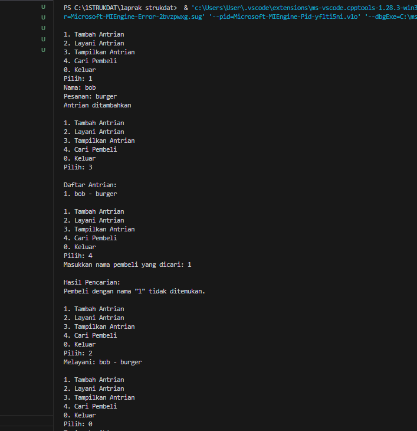
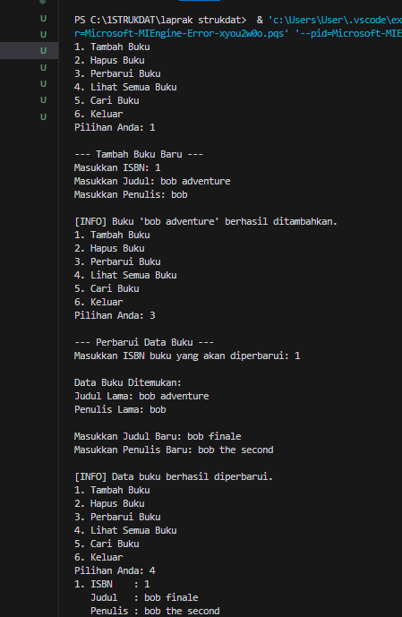

# <h1 align="center">Laporan Praktikum Modul 5 <br> Link List 2 </h1>

<p align="center">Fauza Kaizaku Setiawan - 103112400134</p>

## Dasar Teori

Linked List adalah struktur data linear yang elemen-elemennya (node) tersebar di memori dan dihubungkan oleh pointer atau referensi. Setiap node terdiri dari Data dan Pointer (Next) yang menunjuk ke node berikutnya. Node pertama disebut Head, dan node terakhir disebut Tail, yang pointer-nya menunjuk ke NULL. Keunggulan utamanya adalah alokasi memori yang dinamis dan efisiensi waktu O(1) untuk operasi penyisipan dan penghapusan (setelah lokasi diketahui), karena hanya melibatkan penataan ulang pointer. Namun, kerugian utamanya adalah akses elemen yang lambat (O(n)) karena penelusuran harus selalu dimulai dari Head. Jenis utama meliputi Singly (satu arah), Doubly (dua arah), dan Circular (melingkar).

### Soal 1 guided

### soal 1
```cpp
#include <iostream>
using namespace std;

// Struktur Node
struct Node {
    int data;
    Node* next;
};
Node* head = nullptr;

// Fungsi untuk membuat node baru
Node* createNode(int data) {
    Node* newNode = new Node();
    newNode->data = data;
    newNode->next = nullptr;
    return newNode;
}

// ========== INSERT DEPAN FUNCTION (Penambahan) ==========
void insertDepan(int data) {
    Node* newNode = createNode(data);
    // Logika Insert First: Node baru menunjuk ke head lama, lalu head menunjuk ke Node baru.
    newNode->next = head;
    head = newNode;
    cout << "Data " << data << " berhasil ditambahkan di depan.\n";
}

void insertBelakang(int data) {
    Node* newNode = createNode(data);
    if (head == nullptr) {
        head = newNode;
    } else {
        Node* temp = head;
        while (temp->next != nullptr) {
            temp = temp->next;
        }
        temp->next = newNode;
    }
    cout << "Data " << data << " berhasil ditambahkan di belakang.\n";
}

void insertSetelah(int target, int dataBaru) {
    Node* temp = head;
    while (temp != nullptr && temp->data != target) {
        temp = temp->next;
    }

    if (temp == nullptr) {
        cout << "Data " << target << " tidak ditemukan!\n";
    } else {
        Node* newNode = createNode(dataBaru);
        // Logika Insert After: Sambungkan newNode ke temp->next, lalu temp ke newNode
        newNode->next = temp->next;
        temp->next = newNode;
        cout << "Data " << dataBaru << " berhasil disisipkan setelah " << target << ".\n";
    }
}

// ========== DELETE FUNCTION ==========
void hapusNode(int data) {
    if (head == nullptr) {
        cout << "List kosong!\n";
        return;
    }

    Node* temp = head;
    Node* prev = nullptr;

    // Jika data di node pertama (Delete First)
    if (temp != nullptr && temp->data == data) {
        head = temp->next;
        delete temp;
        cout << "Data " << data << " berhasil dihapus.\n";
        return;
    }

    // Cari node yang akan dihapus
    while (temp != nullptr && temp->data != data) {
        prev = temp;
        temp = temp->next;
    }

    // Jika data tidak ditemukan
    if (temp == nullptr) {
        cout << "Data " << data << " tidak ditemukan!\n";
        return;
    }

    // Putuskan tautan: prev melompati temp
    prev->next = temp->next;
    delete temp;
    cout << "Data " << data << " berhasil dihapus.\n";
}

// ========== UPDATE FUNCTION ==========
void updateNode(int dataLama, int dataBaru) {
    Node* temp = head;
    while (temp != nullptr && temp->data != dataLama) {
        temp = temp->next;
    }

    if (temp == nullptr) {
        cout << "Data " << dataLama << " tidak ditemukan!\n";
    } else {
        temp->data = dataBaru;
        cout << "Data " << dataLama << " berhasil diupdate menjadi " << dataBaru << ".\n";
    }
}

// ========== SEARCH FUNCTION  ==========
void searchData(int key) {
    Node *temp = head;
    int pos = 1;
    bool found = false;

    while (temp != nullptr) {
        // Cek apakah data di node saat ini sama dengan key
        if (temp->data == key) {
            cout << "Data " << key << " ditemukan pada posisi ke-" << pos << endl;
            found = true;
            break; // Hentikan perulangan jika sudah ditemukan
        }
        temp = temp->next; // Geser ke node berikutnya
        pos++;             // Tambah posisi
    }

    // PENTING: Menggunakan 'if (!found)' untuk mengoreksi kesalahan logika asli
    if (!found) { 
        cout << "Data " << key << " tidak ditemukan dalam linked list.\n";
    }
}


// ========== DISPLAY FUNCTION ==========
void tampilkanList() {
    if (head == nullptr) {
        cout << "List kosong!\n";
        return;
    }

    Node* temp = head;
    cout << "Isi Linked List: ";
    while (temp != nullptr) {
        cout << temp->data << " -> ";
        temp = temp->next;
    }
    cout << "NULL\n";
}


// ========== MAIN PROGRAM ==========
int main() {
    int pilihan, data, target, dataBaru;

    do {
        cout << "\n=== MENU SINGLE LINKED LIST ===\n";
        cout << "1. Insert Depan\n";
        cout << "2. Insert Belakang\n";
        cout << "3. Insert Setelah\n";
        cout << "4. Hapus Data\n";
        cout << "5. Update Data\n";
        cout << "6. Tampilkan List\n";
        cout << "7. Cari Data\n"; 
        cout << "0. Keluar\n";
        cout << "Pilih: ";
        if (!(cin >> pilihan)) {
            // Menangani input non-integer
            cin.clear(); 
            cin.ignore(10000, '\n');
            pilihan = -1; // Set pilihan ke nilai default
        }

        switch (pilihan) {
            case 1:
                cout << "Masukkan data: ";
                cin >> data;
                insertDepan(data); 
                break;
            case 2:
                cout << "Masukkan data: ";
                cin >> data;
                insertBelakang(data);
                break;
            case 3:
                cout << "Masukkan data target: ";
                cin >> target;
                cout << "Masukkan data baru: ";
                cin >> dataBaru;
                insertSetelah(target, dataBaru);
                break;
            case 4:
                cout << "Masukkan data yang ingin dihapus: ";
                cin >> data;
                hapusNode(data);
                break;
            case 5:
                cout << "Masukkan data lama: ";
                cin >> data;
                cout << "Masukkan data baru: ";
                cin >> dataBaru;
                updateNode(data, dataBaru);
                break;
            case 6:
                tampilkanList();
                break;
            case 7: // Case baru untuk Search
                cout << "Masukkan data yang dicari (key): ";
                cin >> data;
                searchData(data);
                break;
            case 0:
                cout << "Program selesai.\n";
                break;
            default:
                cout << "Pilihan tidak valid!\n";
        }
    } while (pilihan != 0);

    return 0;
}


```
Program Single Linked List ini membuat struktur data berupa rantai node yang berisi data integer, dimulai dari pointer head sebagai penanda awal list, kemudian menampilkan menu interaktif dengan 6 pilihan operasi yaitu insert depan (menambah node di awal), insert belakang (menambah node di akhir), insert setelah (menyisipkan node setelah nilai tertentu), hapus data (menghapus node berdasarkan nilai), update data (mengubah nilai node lama menjadi baru), dan tampilkan list (menampilkan semua isi dalam format nilai -> nilai -> NULL). Setiap operasi memberikan feedback berhasil atau gagal kepada user, dan menu akan terus berulang hingga user memilih opsi 0 untuk keluar, sehingga program ini merupakan implementasi lengkap struktur data linked list dengan operasi CRUD (Create, Read, Update, Delete) yang sederhana dan interaktif.


## Unguided

### Soal 1

buatlah single linked list untuk Antrian yang menyimpan data pembeli( nama dan pesanan). program memiliki beberapa menu seperti tambah antrian, layani antrian(hapus), dan tampilkan antrian. *antrian pertama harus yang pertama dilayani

```cpp
#include <iostream>
#include <string>
using namespace std;

struct Node {
    string nama;
    string pesanan;
    Node* next;
};

Node* depan = nullptr;
Node* belakang = nullptr;

void tambahAntrian() {
    Node* baru = new Node();
    cout << "Nama: ";
    cin.ignore();
    getline(cin, baru->nama);
    cout << "Pesanan: ";
    getline(cin, baru->pesanan);
    baru->next = nullptr;
    
    if (belakang == nullptr) {
        depan = belakang = baru;
    } else {
        belakang->next = baru;
        belakang = baru;
    }
    cout << "Antrian ditambahkan\n";
}

void layaniAntrian() {
    if (depan == nullptr) {
        cout << "Antrian kosong\n";
        return;
    }
    
    Node* temp = depan;
    cout << "Melayani: " << temp->nama << " - " << temp->pesanan << endl;
    depan = depan->next;
    
    if (depan == nullptr) {
        belakang = nullptr;
    }
    
    delete temp;
}

void tampilkanAntrian() {
    if (depan == nullptr) {
        cout << "Antrian kosong\n";
        return;
    }
    
    Node* temp = depan;
    int no = 1;
    cout << "\nDaftar Antrian:\n";
    while (temp != nullptr) {
        cout << no << ". " << temp->nama << " - " << temp->pesanan << endl;
        temp = temp->next;
        no++;
    }
}

void cariPembeli() {
    if (depan == nullptr) {
        cout << "Antrian kosong\n";
        return;
    }
    
    string namaCari;
    cout << "Masukkan nama pembeli yang dicari: ";
    cin.ignore();
    getline(cin, namaCari);
    
    Node* temp = depan;
    int posisi = 1;
    bool ditemukan = false;
    
    cout << "\nHasil Pencarian:\n";
    while (temp != nullptr) {
        if (temp->nama == namaCari) {
            cout << "Ditemukan di posisi " << posisi << endl;
            cout << "Nama: " << temp->nama << endl;
            cout << "Pesanan: " << temp->pesanan << endl;
            ditemukan = true;
            break;
        }
        temp = temp->next;
        posisi++;
    }
    
    if (!ditemukan) {
        cout << "Pembeli dengan nama \"" << namaCari << "\" tidak ditemukan.\n";
    }
}

int main() {
    int pilih;
    
    do {
        cout << "\n1. Tambah Antrian\n";
        cout << "2. Layani Antrian\n";
        cout << "3. Tampilkan Antrian\n";
        cout << "4. Cari Pembeli\n";
        cout << "0. Keluar\n";
        cout << "Pilih: ";
        cin >> pilih;
        
        if (pilih == 1) {
            tambahAntrian();
        } else if (pilih == 2) {
            layaniAntrian();
        } else if (pilih == 3) {
            tampilkanAntrian();
        } else if (pilih == 4) {
            cariPembeli();
        } else if (pilih == 0) {
            cout << "Terima kasih!\n";
        } else {
            cout << "Pilihan tidak valid!\n";
        }
        
    } while (pilih != 0);
    
    return 0;
}
```

> Output
> 

Program ini menggunakan node yang menyimpan informasi nama pembeli dan pesanan mereka, dengan dua pointer global yaitu depan untuk menunjuk antrian terdepan dan belakang untuk menunjuk antrian terakhir. Fungsi tambahAntrian memungkinkan penambahan pelanggan baru di akhir antrian dengan mengalokasikan node baru dan menghubungkannya ke node terakhir. Fungsi layaniAntrian melayani pelanggan yang ada di depan antrian dengan menampilkan informasinya, kemudian menghapus node tersebut dan memindahkan pointer depan ke antrian berikutnya.

### Soal 2


```cpp
#include <iostream>
#include <string>

using namespace std;

struct infotype {
    string isbn;
    string judul;
    string penulis;
};

typedef struct elmlist *address;

struct elmlist {
    infotype info;
    address next;
};

struct List {
    address first;
};

void createList(List &L) {
    L.first = NULL;
}

address alokasi(infotype data) {
    address P = new elmlist;
    P->info.isbn = data.isbn;
    P->info.judul = data.judul;
    P->info.penulis = data.penulis;
    P->next = NULL;
    return P;
}

void dealokasi(address &P) {
    delete P;
}

address cariBukuByISBN(List L, string isbn) {
    address P = L.first;
    while (P != NULL) {
        if (P->info.isbn == isbn) {
            return P;
        }
        P = P->next;
    }
    return NULL;
}


void cariDanTampilkanBuku(List L) {
    if (L.first == NULL) {
        cout << "\n[INFO] Daftar buku masih kosong, tidak ada yang bisa dicari." << endl;
        return;
    }

    int pilihanCari;
    cout << "\n--- Cari Buku Berdasarkan ---" << endl;
    cout << "1. Judul" << endl;
    cout << "2. Penulis" << endl;
    cout << "3. ISBN" << endl;
    cout << "Pilihan Anda: ";
    cin >> pilihanCari;

    if (cin.fail() || pilihanCari < 1 || pilihanCari > 3) {
        cin.clear(); 
        cin.ignore(10000, '\n'); 
        cout << "\n[ERROR] Pilihan tidak valid." << endl;
        return;
    }

    string keyword;
    cout << "Masukkan kata kunci pencarian: ";
    cin.ignore(); 
    getline(cin, keyword);

    address P = L.first;
    bool ditemukan = false;
    int i = 1;

    while (P != NULL) {
        bool cocok = false;
        if (pilihanCari == 1 && P->info.judul.find(keyword) != string::npos) {
            cocok = true;
        } else if (pilihanCari == 2 && P->info.penulis.find(keyword) != string::npos) {
            cocok = true;
        } else if (pilihanCari == 3 && P->info.isbn == keyword) {
            cocok = true;
        }

        if (cocok) {
            cout << i << ". ISBN    : " << P->info.isbn << endl;
            cout << "   Judul   : " << P->info.judul << endl;
            cout << "   Penulis : " << P->info.penulis << endl;
            ditemukan = true;
            i++;
        }
        P = P->next;
    }

    if (!ditemukan) {
        cout << "   (Buku dengan kata kunci '" << keyword << "' tidak ditemukan)" << endl;
    }

}


void tambahBuku(List &L, infotype data) {
    address P = alokasi(data);
    if (L.first == NULL) {
        L.first = P;
    } else {
        address Q = L.first;
        while (Q->next != NULL) {
            Q = Q->next;
        }
        Q->next = P;
    }
    cout << "\n[INFO] Buku '" << data.judul << "' berhasil ditambahkan." << endl;
}

void hapusBuku(List &L, string isbn) {
    address P = cariBukuByISBN(L, isbn);

    if (P == NULL) {
        cout << "\n[ERROR] Buku dengan ISBN " << isbn << " tidak ditemukan." << endl;
        return;
    }

    if (P == L.first) {
        L.first = P->next;
    } else {
        address prev = L.first;
        while (prev->next != P) {
            prev = prev->next;
        }
        prev->next = P->next;
    }

    cout << "\n[INFO] Buku '" << P->info.judul << "' berhasil dihapus." << endl;
    dealokasi(P);
}

void updateBuku(List &L, string isbn) {
    address P = cariBukuByISBN(L, isbn);
    if (P != NULL) {
        cout << "\nData Buku Ditemukan:" << endl;
        cout << "Judul Lama: " << P->info.judul << endl;
        cout << "Penulis Lama: " << P->info.penulis << endl;

        cout << "\nMasukkan Judul Baru: ";
        cin.ignore();
        getline(cin, P->info.judul);

        cout << "Masukkan Penulis Baru: ";
        getline(cin, P->info.penulis);

        cout << "\n[INFO] Data buku berhasil diperbarui." << endl;
    } else {
        cout << "\n[ERROR] Buku dengan ISBN " << isbn << " tidak ditemukan." << endl;
    }
}

void lihatBuku(List L) {
    if (L.first == NULL) {
        cout << "               (Tidak ada buku di daftar)" << endl;
    } else {
        address P = L.first;
        int i = 1;
        while (P != NULL) {
            cout << i << ". ISBN    : " << P->info.isbn << endl;
            cout << "   Judul   : " << P->info.judul << endl;
            cout << "   Penulis : " << P->info.penulis << endl;
            P = P->next;
            i++;
        }
    }
}

int main() {
    List daftar_buku;
    createList(daftar_buku);
    int pilihan;
    string isbn;
    infotype dataBuku;

    do {
        cout << "1. Tambah Buku" << endl;
        cout << "2. Hapus Buku" << endl;
        cout << "3. Perbarui Buku" << endl;
        cout << "4. Lihat Semua Buku" << endl;
        cout << "5. Cari Buku" << endl;
        cout << "6. Keluar" << endl;
        cout << "Pilihan Anda: ";
        cin >> pilihan;
        

        if (cin.fail()) {
            cout << "\n[ERROR] Input harus berupa angka." << endl;
            cin.clear();
            cin.ignore(10000, '\n'); 
            pilihan = 0; 
            continue; 
        }


        switch (pilihan) {
            case 1:
                cout << "\n--- Tambah Buku Baru ---" << endl;
                cout << "Masukkan ISBN: ";
                cin >> dataBuku.isbn;
                cout << "Masukkan Judul: ";
                cin.ignore();
                getline(cin, dataBuku.judul);
                cout << "Masukkan Penulis: ";
                getline(cin, dataBuku.penulis);
                tambahBuku(daftar_buku, dataBuku);
                break;
            case 2:
                cout << "\n--- Hapus Buku ---" << endl;
                cout << "Masukkan ISBN buku yang akan dihapus: ";
                cin >> isbn;
                hapusBuku(daftar_buku, isbn);
                break;
            case 3:
                cout << "\n--- Perbarui Data Buku ---" << endl;
                cout << "Masukkan ISBN buku yang akan diperbarui: ";
                cin >> isbn;
                updateBuku(daftar_buku, isbn);
                break;
            case 4:
                lihatBuku(daftar_buku);
                break;
            case 5:
                cariDanTampilkanBuku(daftar_buku);
                break;
            case 6:
                cout << "\nTerima kasih! Program selesai." << endl;
                break;
            default:
                cout << "\n[ERROR] Pilihan tidak valid. Silakan coba lagi." << endl;
                break;
        }
    } while (pilihan != 6);

    return 0;
}

```

> Output
> 

program ini menyediakan menu interaktif dengan enam pilihan. Pengguna dapat menambahkan buku baru yang akan disisipkan di akhir list, menghapus buku berdasarkan ISBN tertentu, memperbarui data judul dan penulis buku yang sudah ada, serta melihat seluruh daftar buku yang tersimpan. Terdapat juga fitur pencarian yang memungkinkan pengguna mencari buku berdasarkan tiga kriteria yaitu judul, penulis, atau ISBN dengan menggunakan kata kunci.


## Referensi

1. Putra, C. K. K., & Hermawan, H. D. (2023). Pengembangan Media Pembelajaran Mobile Pemrograman C++ pada Siswa Kelas X SMK Binawiyata Sragen. Jurnal Pendidikan Teknik Informatika, 2(1), 18–27. https://eprints.ums.ac.id/115405/10/Naskah%20Publikasi_Canygia%20Kalindra%20Putra.pdf

2. Fitriyah, Q. F., Saputri, L. R., & Aljawad, H. I. (2023). Praktik Unplugged Coding Berbasis Kehidupan Sehari-hari dalam Meningkatkan Kemampuan Computational Thinking pada Anak Usia Dini. Jurnal Pendidikan Anak, 12(2), 178–185. https://journal.uny.ac.id/index.php/jpa/article/download/57349/20585/190619

3. Hendrawan, A. (2015). Standard Template Library C++ untuk Mengajarkan Struktur Data. Jurnal Ilmu Komputer, 12(1), 23–30. Universitas Esa Unggul. https://ejurnal.esaunggul.ac.id/index.php/JIK/article/view/397